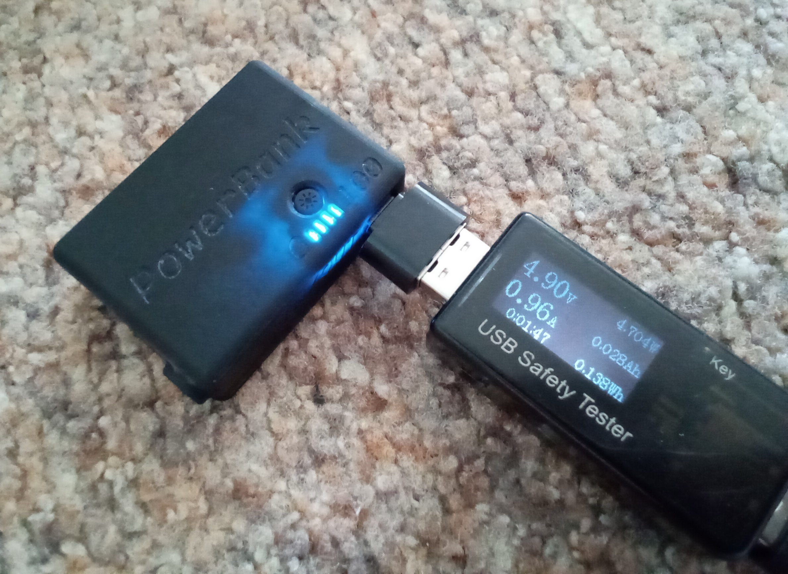
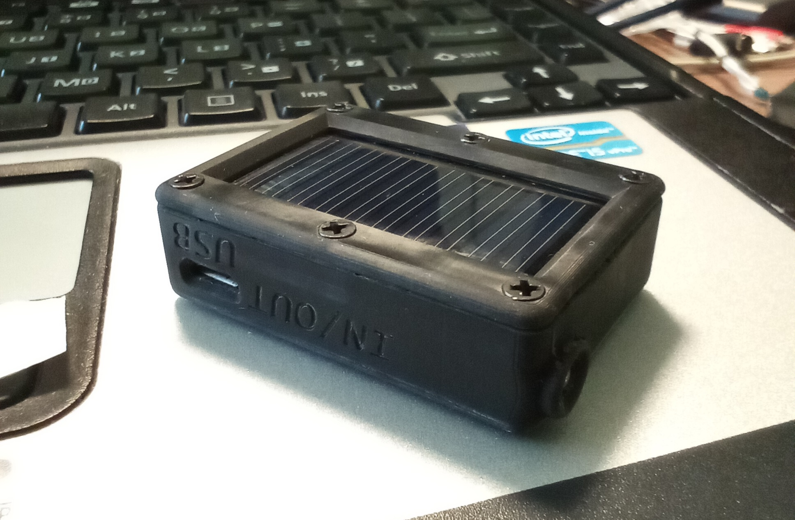
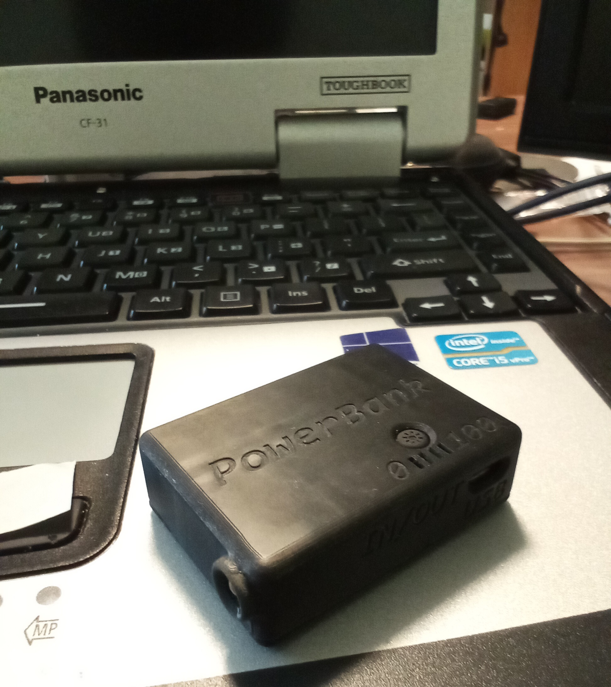
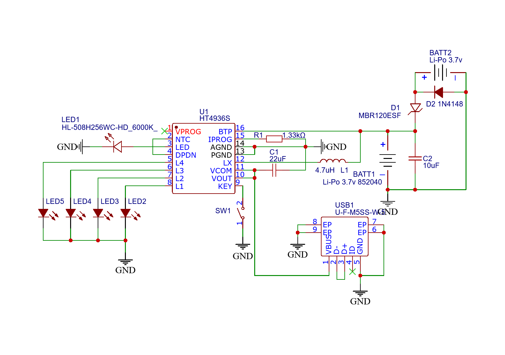
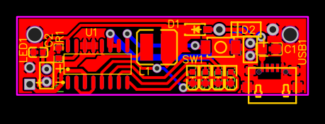
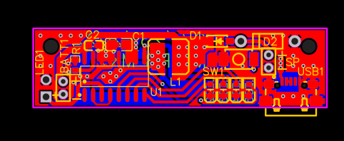
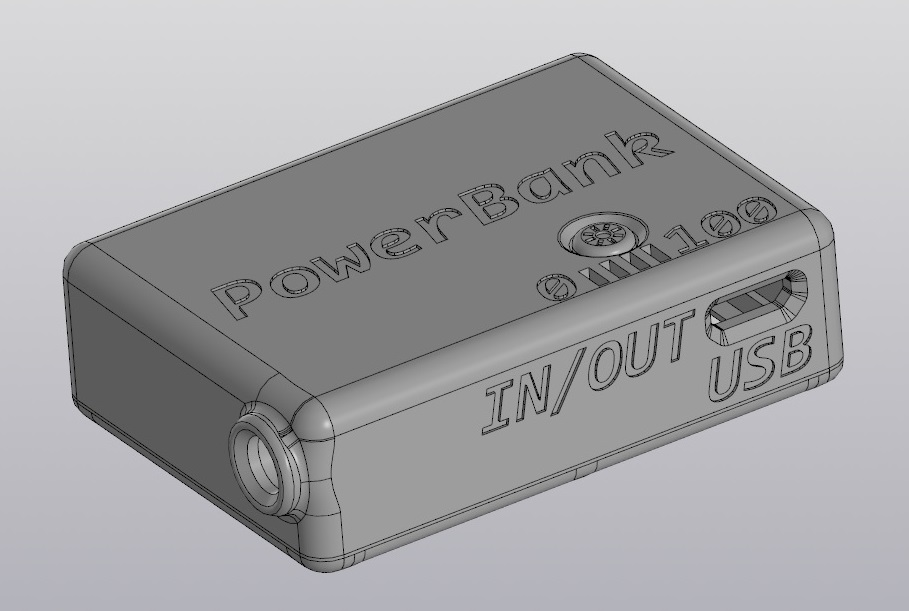
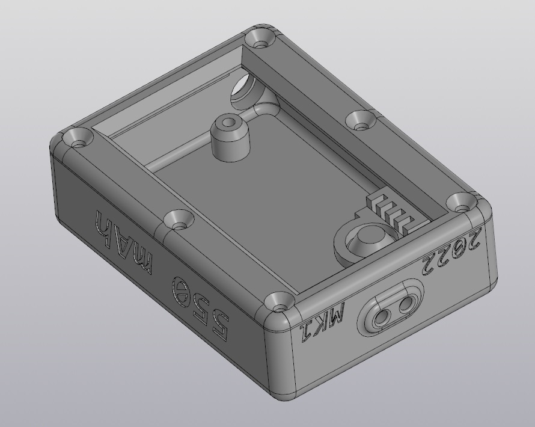
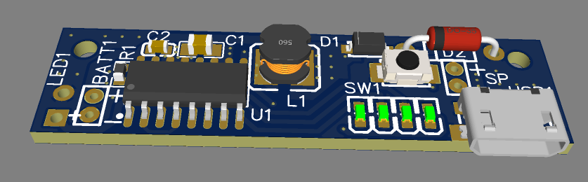
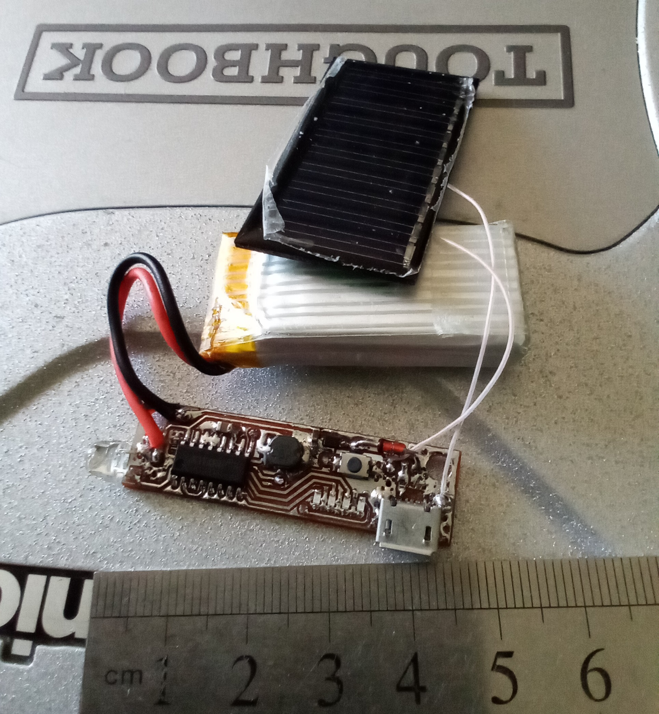

# Mini-PB: Ультра-компактный Power Bank для ключей

**Mini-PB** — это хобби-проект "выходного дня": миниатюрный power bank, который можно собрать за пару вечеров. Его размер позволяет носить его как брелок на ключах, чтобы в экстренной ситуации подзарядить телефон на несколько процентов для важного звонка или запитать мелкие гаджеты вроде фитнес-браслета или наушников.

На момент создания это был, возможно, самый маленький самодельный power bank. Проект демонстрирует полный цикл быстрой разработки: от идеи и схемы до 3D-модели корпуса, изготовления платы и сборки готового устройства.

## 🚀 Ключевые особенности

*   **Ультра-компактный размер:** Легко помещается в карман или вешается на ключи.
*   **Экстренный заряд:** Аккумулятор ёмкостью ~550 мАч способен дать смартфону 5-10% заряда.
*   **Встроенный фонарик:** Яркий 5-мм светодиод всегда под рукой.
*   **Индикатор заряда:** 4 светодиода наглядно показывают оставшийся уровень энергии.
*   **Двойная зарядка:** Устройство можно заряжать как от Micro-USB, так и от солнечной панели.
*   **Простота сборки:** Минимальное количество компонентов и простая плата делают проект доступным для повторения даже начинающим.

## 🛠️ Технические характеристики

*   **Сердце устройства:** Микросхема `HT4936S` — готовое решение "всё в одном" для power bank'ов, включающее контроллер заряда Li-Po, повышающий преобразователь (boost converter) и драйвер для светодиодной индикации.
*   **Аккумулятор:** Li-Po 3.7В, 550 мАч (типоразмер `852040`).
*   **Солнечная панель:** 5В, 25 мА (45x25 мм).
*   **Фонарик:** Белый светодиод 5мм (`HL-508H256WC-HD`).
*   **Разъемы:** Micro-USB для зарядки самого устройства и для отдачи заряда (через OTG-переходник).
*   **Корпус:** Разработан в САПР **КОМПАС-3D** и напечатан на SLA 3D-принтере.

## ⚙️ Процесс создания

### 1. Схемотехника и проектирование платы

Вся логика работы реализована на базе специализированной микросхемы **HT4936S**, что позволило максимально упростить схему. Она отвечает за корректную зарядку литиевого аккумулятора, повышение напряжения до 5В для USB-выхода, а также за управление фонариком и индикацией по нажатию кнопки.

Схема и печатная плата были разработаны в среде **EasyEDA**. Подготовлены две версии топологии:
*   **Для домашнего изготовления:** Односторонняя плата с широкими дорожками для фрезеровки на ЧПУ-станке (требуется 3 перемычки).
*   **Для фабричного производства:** Компактная двухслойная плата (Gerber-файлы прилагаются).

**Электрическая схема:**

**Топология печатной платы:**

### 2. 3D-моделирование и печать корпуса

Корпус спроектирован с учетом габаритов всех компонентов: платы, аккумулятора и солнечной панели. Предусмотрены все необходимые отверстия для разъема, кнопки, светодиодов и крепёжных винтов.

Модели готовы для печати на любом FDM/SLA 3D-принтере.

### 3. Сборка и тестирование

Сборка устройства предельно проста. Все компоненты монтируются на печатную плату, после чего плата и аккумулятор устанавливаются в корпус. Солнечня панель приклеивается к плате, а её провода припаиваются к специальным площадкам `SP+` и `SP-` на плате.

## 🔧 Как повторить проект

1.  **Закажите компоненты** по списку ниже (BOM).
2.  **Изготовьте печатную плату.** Используйте архив `gerber_pcb.zip` для заказа на любом сервисе (например, JLCPCB, PCBWay).
3.  **Напечатайте корпус.** В архиве `stl.7zip` находятся STL-модели для 3D-принтера. Выберите версию корпуса в зависимости от того, будете ли вы использовать солнечную панель.
4.  **Припаяйте компоненты** к плате согласно схеме.
5.  **Подключите солечную панель и аккумулятор** (можно приклеить их плате / корпусу на двусторонний скотч).
6.  **Соберите корпус**, закрепив плату и крышку винтами М2.

## 📋 Список компонентов (BOM)

| Designator         | Компонент / Номинал | Корпус (Footprint)        | Кол-во |
| ------------------ | ------------------- | ------------------------- | ------ |
| U1                 | HT4936S             | SOP-16                    | 1      |
| BATT1              | Li-Po 3.7V 550mAh   | Pads                      | 1      |
| USB1               | Micro USB Port      | Micro-USB-SMD             | 1      |
| L1                 | 4.7uH               | SMD 4.5x4.0mm             | 1      |
| C1                 | 22uF                | 0805                      | 1      |
| C2                 | 10uF                | 0603                      | 1      |
| R1                 | 1.33kΩ              | 0603                      | 1      |
| D1                 | MBR120ESF           | SOD-123                   | 1      |
| D2                 | 1N4148              | DO-35 (THT)               | 1      |
| SW1                | Тактовая кнопка     | SMD 3.9x3.0mm             | 1      |
| LED1 (Фонарик)     | Белый светодиод 5мм | 5mm THT                   | 1      |
| LED2, LED3, LED4, LED5 | Красные светодиоды  | 0603                      | 4      |
| -                  | Солнечная панель  | 45x25mm                 | 1      |
| -                  | Винты М2 потай      | -                         | 8      |

Все необходимые детали можно найти в свободном доступе на AliExpress.

## 📂 Файлы проекта

*   `/gerber` - Gerber-файлы для заказа печатных плат на производстве или изготовлении на ЧПУ.
*   `/stl.7zip` - STL-модели для 3D-печати корпуса (несколько вариантов, в т.ч. под солнечную панель).
*   `/3d` - Исходные файлы 3D-моделей.
*   `/img` - Изображения, рендеры и схема проекта.

## License
This project is licensed under the [CC BY-NC-SA 4.0](https://creativecommons.org/licenses/by-nc-sa/4.0/) license.
